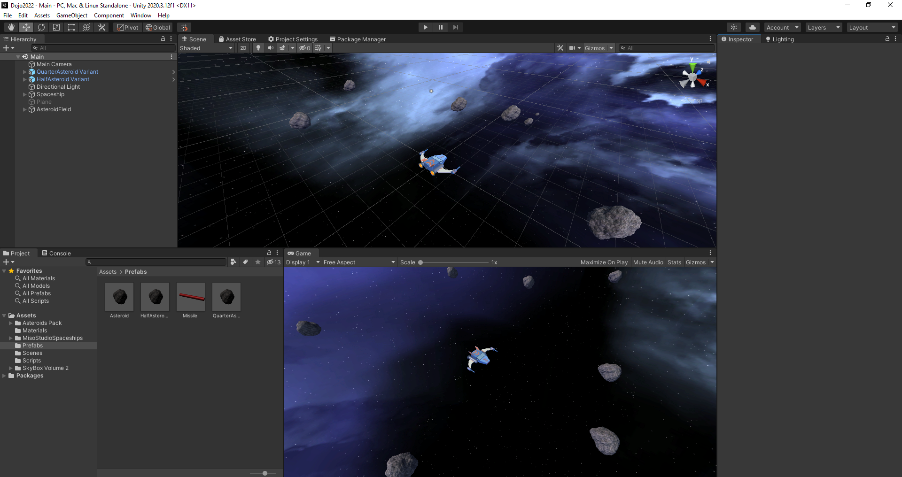

# Unity discovering dojo

## Assets required
To work properly, the project required these package in their default location 
- https://assetstore.unity.com/packages/3d/characters/toon-spaceships-102417#content (version 1.0)
- https://assetstore.unity.com/packages/3d/environments/asteroids-pack-84988 (version 1.0)
- https://assetstore.unity.com/packages/2d/textures-materials/sky/skybox-volume-2-nebula-3392 (version 1.0)

## Goal
- Game
 - asteroid-like game
 - 3D, but playing on a plane and restraining moves on it
- basic intro to Unity
 - no virtual reality...yet ;)

## Steps
### 0 - Context
- scene / inspector
- component architecture
- c#

### 1 - Spaceship model
- Cube spaceship
 - Collider : size != model
 - Materials
 - Child gameobject
- Sample fun with rigidbody

### 2-PositionBasedMovement
- Input: axes
- Public attributes and inspector
- transform attribute (and the need to “find” sibling components)
- Time.deltaTime
- Rotation and local axis

### 3-ForceBasedMovement
- Getcomponent
- Start
- Rb / rigidBody
- AddForce / Drag / AngularDrag

### 4-Prefab
- Collision
- Constraints
- Velocity
- Random / randomInsideUnitSphere

### 5-AssetStore
- Spaceship model & asteroid model
- scale/adaptation/fix
- sphere collider
- Prefab update from scene (overrides)

### 6-ObjectSpawning
- Instanciate
- Gameobject reference (prefab, or scene object)
- Tag to determine object kind in collision efficiently
- (Optional) Layer to filter collisions
- (Optional) Delayed Invoke

### 7-Visuals
- Lighting and skybox
- Camera follow (offset)
- Particle system for space dust
- Asteroid field for spawn : list, distance, …

## Memos
- Git ignore https://github.com/github/gitignore/blob/main/Unity.gitignore 
- AddForce https://www.reddit.com/r/Unity3D/comments/psukm1/know_the_difference_between_forcemodes_a_little/ 
- Collider matrix: https://docs.unity3d.com/Manual/CollidersOverview.html 
